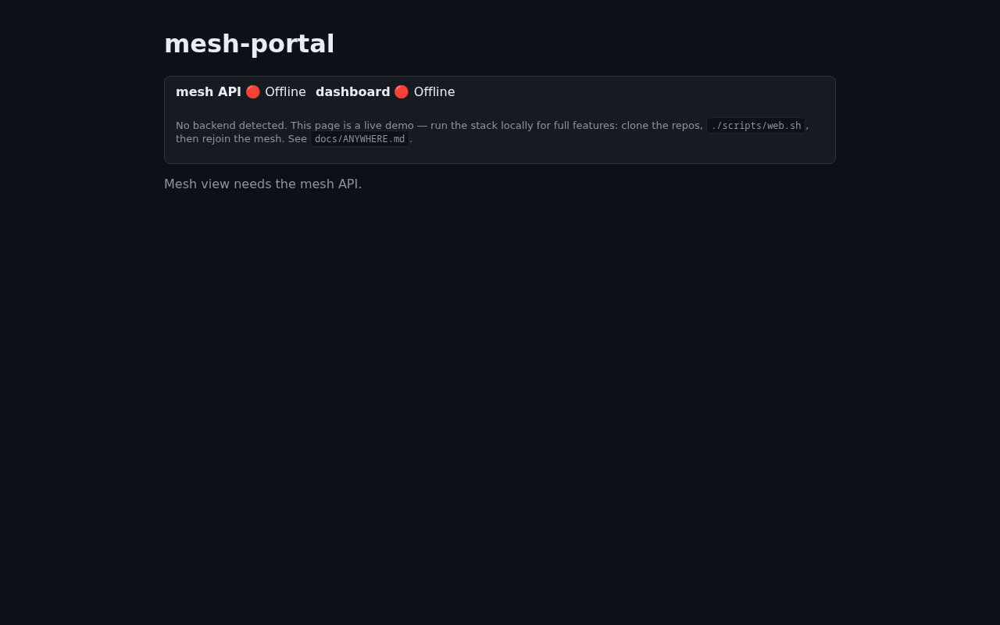
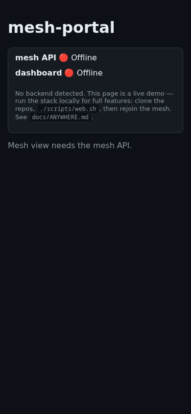
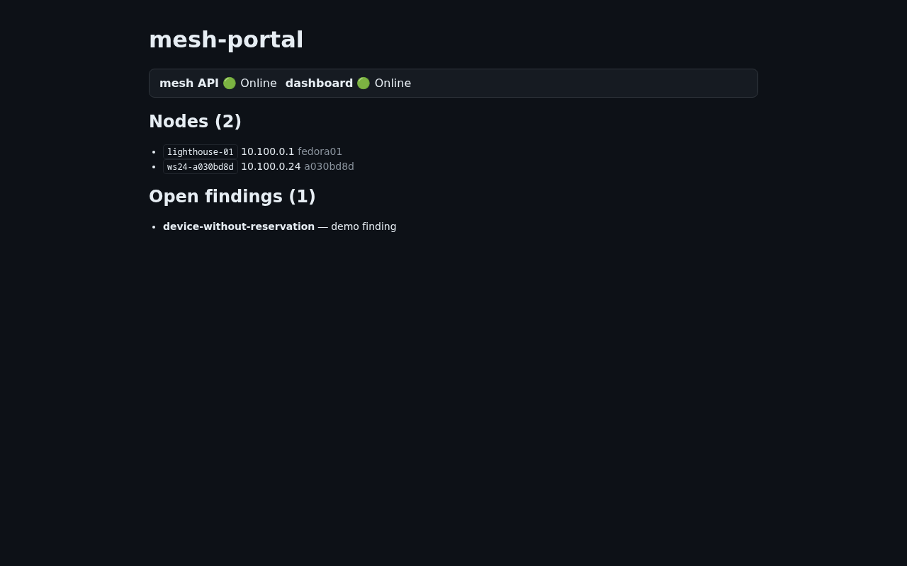
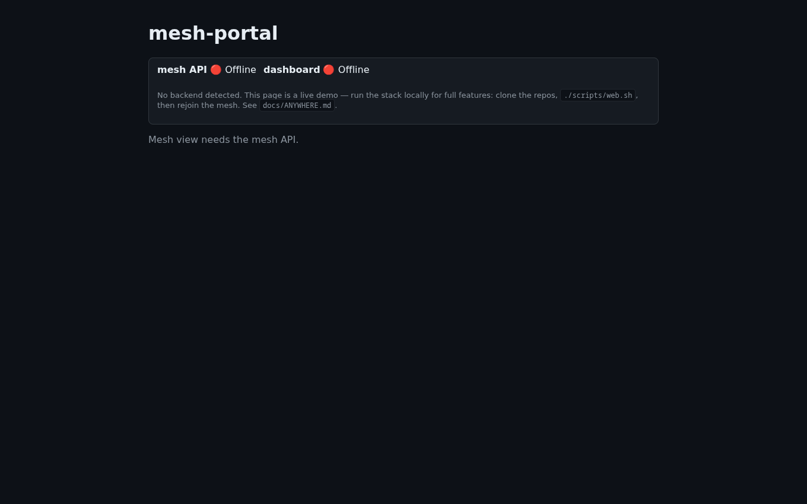
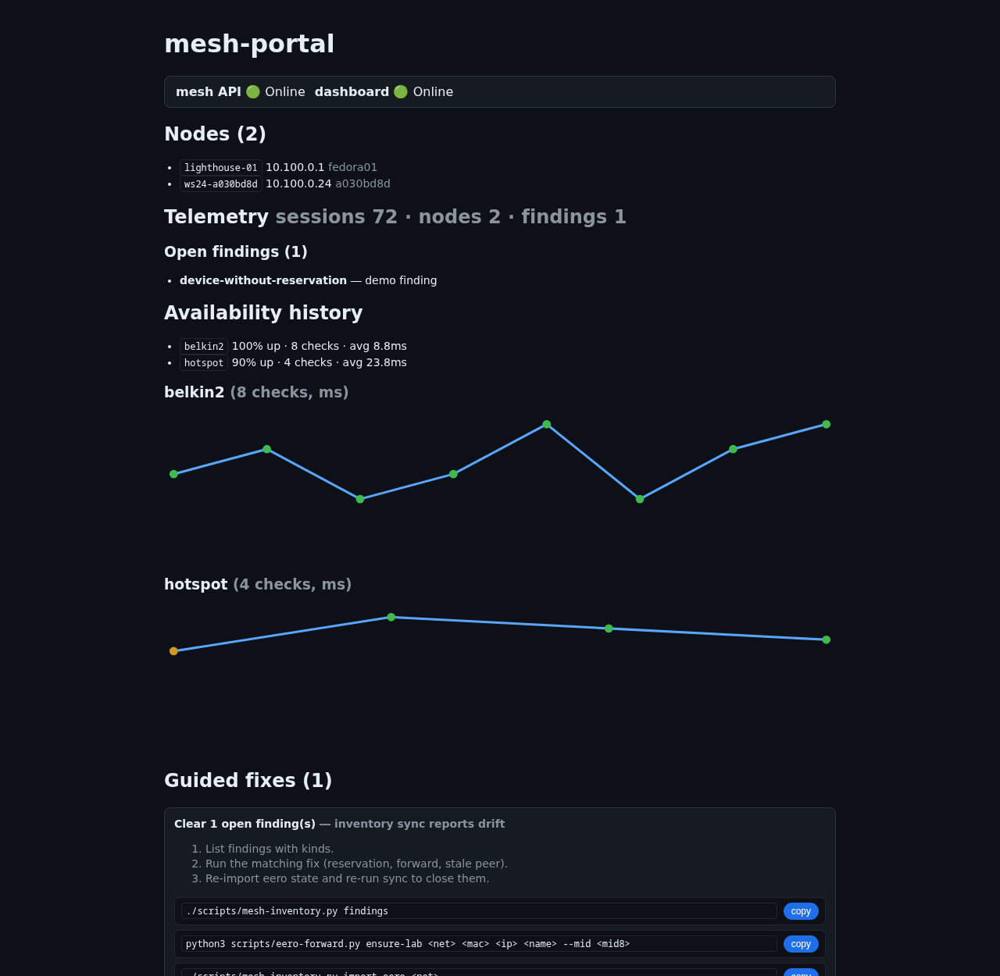
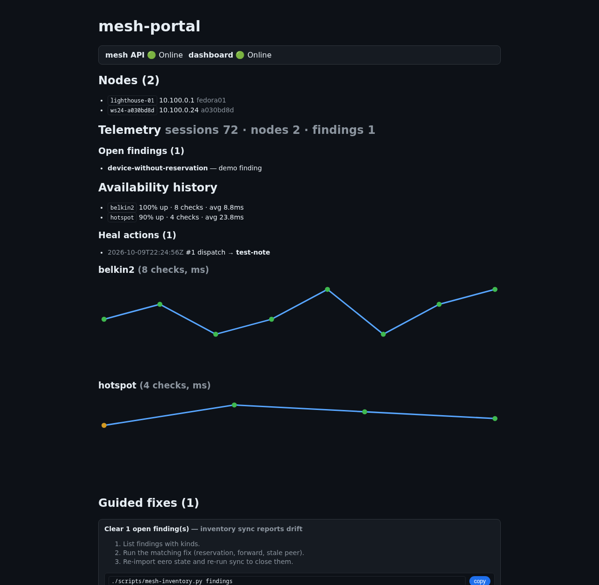
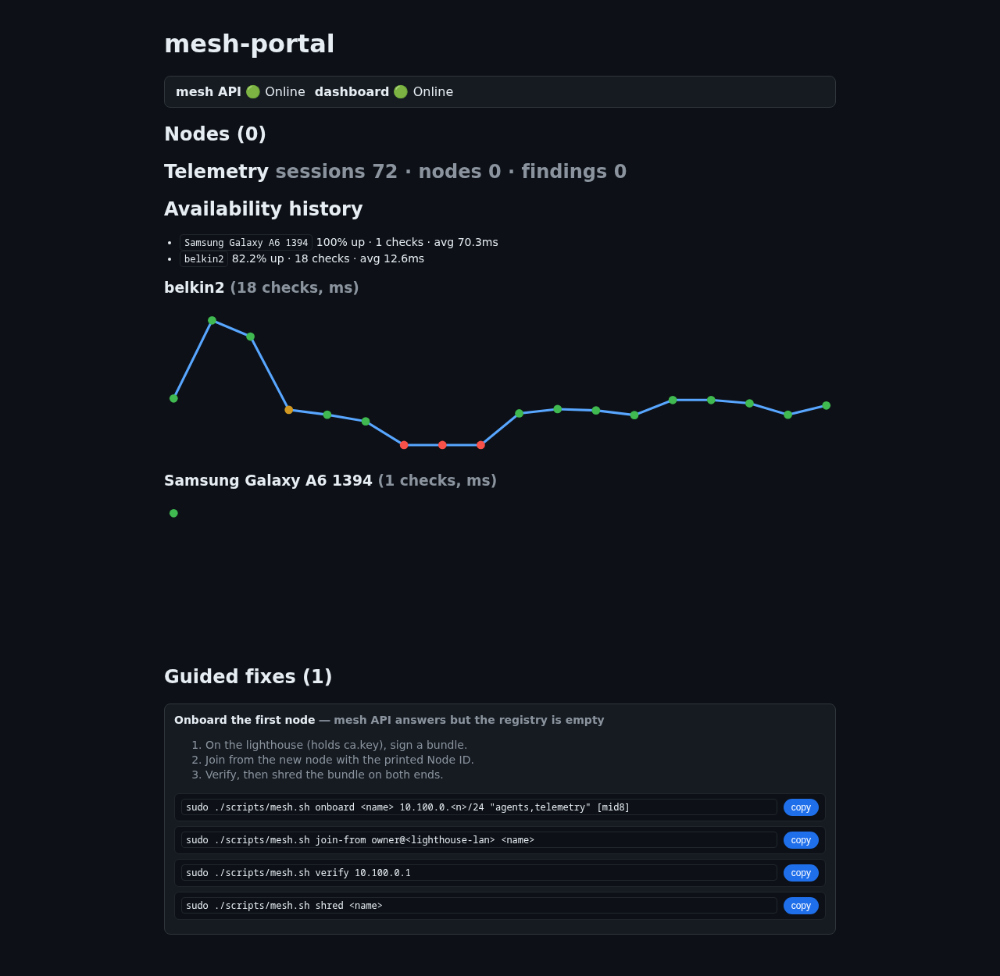
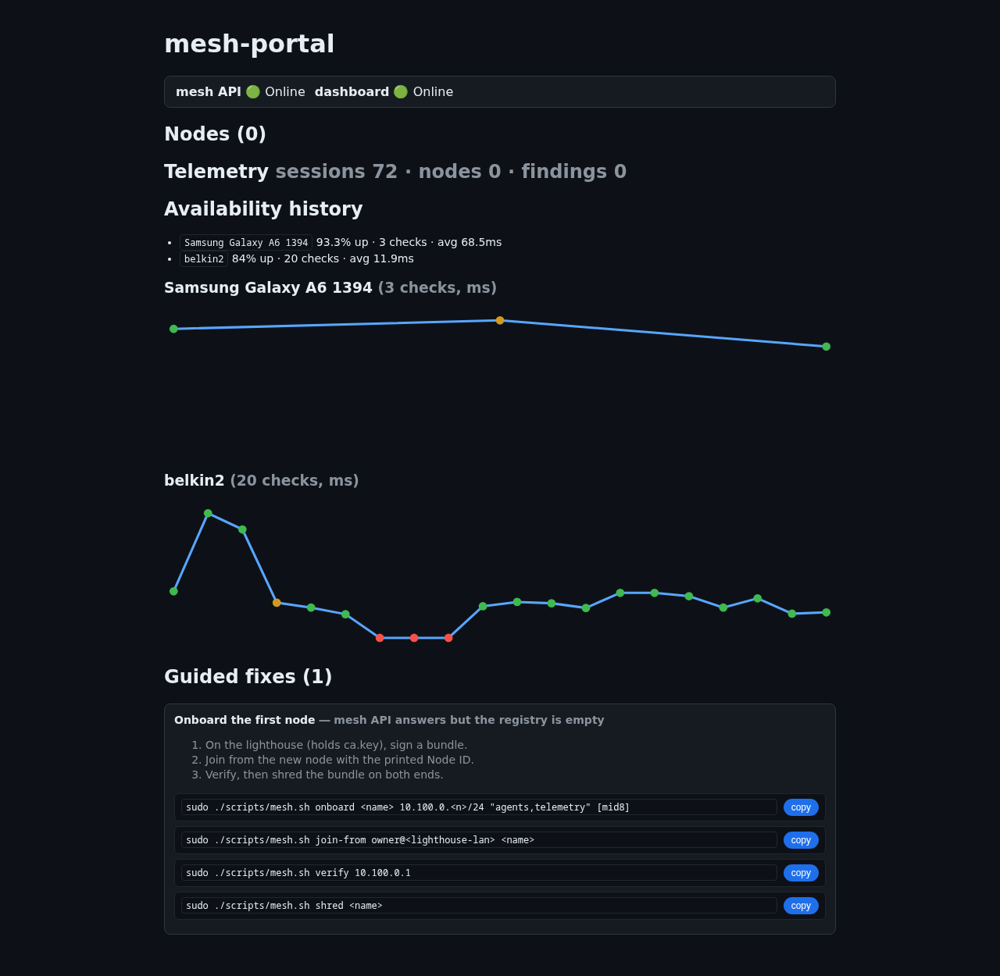
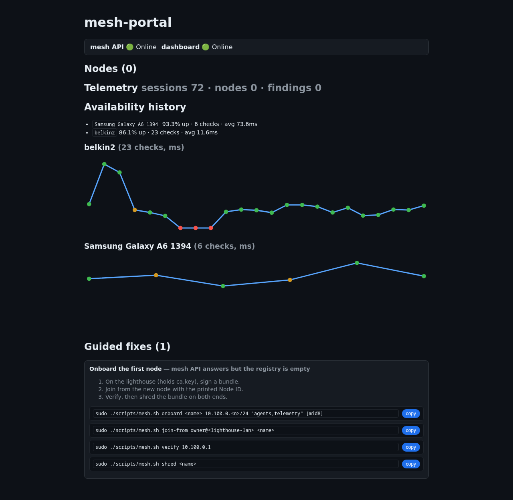
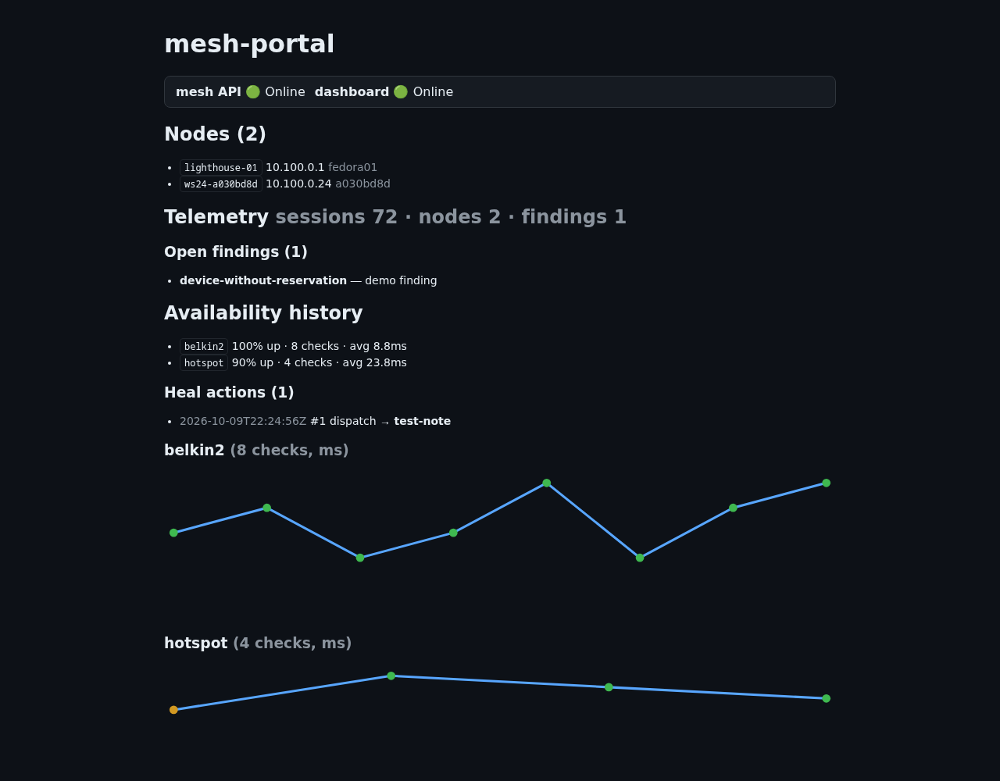

# mesh-portal

Unified read view for the mesh: sessions, nodes, findings, certs — one
glance, zero new authority. Vite + React + TS, GitHub Pages friendly.

Live: **https://swipswaps.github.io/mesh-portal/** (all screenshots below
taken in real `google-chrome-stable` via Playwright — no mocks).

## What it looks like

Backend absent (public Pages, no local stack) — honest offline state with
onboarding instead of spinners:



Same, 390px mobile — no horizontal scroll, no tiny targets:



Backends up (local preview against live mesh API + dashboard, strict TLS,
no bypass flags) — both dots green, real nodes and findings:



Full chain over the **public Pages origin** (real Chrome, strict TLS):
both dots green against `127.0.0.1` backends — trust + CORS +
Private-Network headers all verified end to end:



Database-driven telemetry + availability history (sparklines per
network, loss-colored dots) + guided fixes with click-to-copy commands:



Heal actions audit trail (every close-loop attempt logged, successes and
failures alike):



Live roam evidence (real DB, not fixtures): `belkin2` 18 checks with
captured loss events (red dots), `Samsung Galaxy A6 1394` single roam
check at 70.3ms — the phone-hotspot roam this portal was built to prove:



Second live roam (fresh run, same networks): hotspot accumulates to 3
checks with its own partial-loss event (amber dot), belkin2 to 20 —
the monitor loop keeps writing while roams repeat:



Scripted switch cycle via `mesh-wifi-switch.sh` (belkin2 → hotspot →
belkin2, receipts each leg, rollback on failure): hotspot history keeps
accumulating across runs, belkin2 holds its loss-event record:




## Islanded-node wifi recovery

`mesh-wifi-switch.sh` (mesh repo `scripts/`) switches a node to a target
SSID with rescan-first, rollback, and receipts — locally or over SSH:

```bash
./scripts/mesh-wifi-switch.sh belkin2
./scripts/mesh-wifi-switch.sh --remote owner@10.100.0.1 belkin2
```

Proven behavior: an islanded lighthouse (off-LAN, forward pointing at
its dead interface) is **refused, not attempted** — no SSH path means no
safe remote switch exists, and a blind attempt would strand it. Recovery
is then hands-on at the node (or NM autoconnect when it roams back),
after which the portal below shows both nodes green again:



## Interactive evaluation

`tests/interactive-eval.py` runs real `google-chrome-stable` **headed**
(slow motion, watch on `:0`): three render steps, then a both-devices API
matrix (loopback + mesh IPs, both nodes). Reports per-step timings,
console errors, pageerrors, plus probes classified into blockers
(`CERT-AUTHORITY`, `CERT-DOMAIN`, `CORS`, `LNA-DENIED`, `DOWN`, `SLOW`,
`CONSOLE`) each with its fix; bottlenecks print slowest-first.
Screenshots land in `docs/screenshots/`.

Proven LNA nuance (queried live): same browser reports `prompt` on
localhost origins but `denied` on public Pages — the permission model
keys off requester address space, so localhost-served copies need no
grant while public Pages always does. The UI branches on the queried
state instead of assuming.

```bash
python3 tests/interactive-eval.py --shots docs/screenshots --slow 400
```

UX issues it has already surfaced and fixed: socat-TLS-shim flakiness
under parallel probes → native `--tls-cert` in `mesh-api.py`; missing
Private-Network headers (public→loopback blocked despite CORS) → added
both servers; `sqlite3.Row` 503 ghost in `/api/mesh`; console-spam
polling → dead-stop on static hosting.

## Model (from receipts-ocr, verified portable)

- `src/config.ts`: backend origins derived from `window.location.hostname`
  (Pages → loopback fail-fast + onboarding; localhost → loopback ports;
  LAN/mesh → same host). No config, works everywhere.
- `src/services/health.ts`: one probe per backend (10s, quiet 60s backoff
  when absent, dead-stop on static hosting — browsers log every failed
  fetch, so frequency is the only console-spam lever we own).
- `src/services/lna.ts`: Local Network Access permission detection.
  Chrome 153+ gates public→loopback fetches behind a user grant *beyond*
  CORS and Private-Network headers; the failure is opaque (TypeError) but
  the permission state is queryable, so the UI names the fix (address-bar
  → Site settings → Local network access → Allow) instead of shrugging.
- Advanced views mount only when their backend is healthy. No secrets in
  the bundle: read APIs only, no Basic auth, no tokens.

## Backend contract (mesh-api.py + dashboard read APIs)

- `GET /api/rev` → any 2xx JSON (health).
- `GET /api/mesh` → `{available, nodes, peers, findings}` (503-style
  `{available:false}` when the node has no inventory).
- Dashboard `:5099` read APIs as listed in `docs/ANYWHERE.md`.
- All read routes serve CORS `*` + Private-Network headers + `OPTIONS`
  preflight (verified live against both servers).

## UX issues found by testing (all in real Chrome)

1. **Public→loopback needs THREE grants, not one** (TLS trust + CORS/PNA
   headers + LNA permission). Each was a separate debugging session; the
   portal now sequences them in the UI (trust card → LNA card → content).
   Lesson: browser vendors keep adding gates — detect, don't diagnose.
2. **Console spam is unavoidable, only rate-controllable.** Failed fetches
   log regardless of `catch`; receipts-ocr spams 6 errors per cycle
   forever. We probe once then dead-stop on static hosting.
3. **Empty findings render a bare header** (`Open findings (0)` + empty
   list). Acceptable; a `none 🎉` state is queued, not blocking.
4. **Rows are not yet links** — no drill-down (nodes → detail). Queued
   behind multi-node reads.
5. **First load carries React (228KB)** vs the old dashboard's zero-build
   instant paint. Accepted: the interactivity ceiling (dual health state,
   permission branching) is what justified the framework.

## Develop

```bash
npm install
npm run dev      # http://localhost:5173
npm run build    # tsc + vite -> dist/
npm run preview  # serve dist on :4173
npm test         # playwright vs preview (backend-absent assertions)
```

Debug: `?api-mesh=<origin>&api-dash=<origin>` overrides backend origins
(the offline test pins unroutable ones for determinism — headless shell
ignores cert errors, so live backends would flip its dots green).

Deploy: push to `main` → Actions `deploy.yml` (pinned `ubuntu-24.04`) →
Pages. Screenshots here are regenerated the same way (`docs/`
procedure: Playwright `channel='chrome'`, desktop + 390px).
